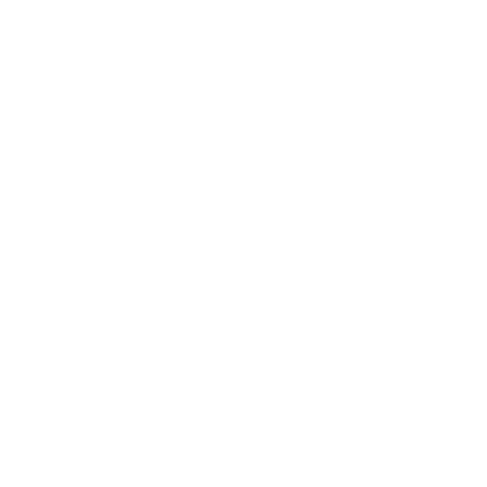

# NUS Seafarers' Website


<figure>
  
</figure>


This is the website documenting the voyages of NUS Seafarers, in which we showcase our best stories, photos, videos, and explore interesting topics like celestial navigation, SEA culture and sailing.

## Contribution

We welcome contributions and suggestions from all voyagers. Whether you are a programmer or not, you can always write your blog post, report bugs, or make suggestions under the [Issues](https://github.com/NUSSeafarers/NUSSeafarers.github.io/issues) page of this repository.

If you want to add blog posts by yourself, please [contact our team](mailto:guzh@comp.nus.edu.sg) or ask in the telegram group, so that we can add you into the [NUS Seafarers](https://github.com/NUSSeafarers) organization on GitHub.

Please avoid posting personal information and other sensitive stuff on the website.

### General

- Currently, our website is using [Bulma clean theme](https://github.com/chrisrhymes/bulma-clean-theme), a simple web theme supporting blogs, galleries and youtube videos. You may refer to [this website](https://www.csrhymes.com/bulma-clean-theme/docs/) for detailed documentation on how to create pages, add photos and videos, and many other functionalities.
- Before you commit your contributions, you may build the website locally using jekyll. See [this documentation](https://jekyllrb.com/docs/) for details.


### Adding blog posts

Creating blog posts is very simple and can be done on the GitHub website directly.

- **Step 1**: Create a markdown file under the [`/_posts`](https://github.com/NUSSeafarers/NUSSeafarers.github.io/tree/main/_posts) directory, with the file name in the syntax of `YYYY-MM-DD-title-author.markdown`.
- **Step 2**: At the beginning of the markdown file, add the configurations as the following:

  ```
  ---
  layout: post
  title:  "Voyage across the Equator"
  hero_height: small
  author: "NUS News"
  date:   2017-01-29
  source_link: 'https://news.nus.edu.sg/voyage-across-the-equator/'
  image: '/images/voyages/2017-across-the-equator/kayaks-nus-news.png'
  published: true
  ---
  ```

  where the `source_link` (link to the related posts) and `image` (the hero image shown on the blog page) options are optional.

- **Step 3**: Write your blog post below the configuration. See [this post](./_posts/2017-01-29-voyage-across-the-equator-nus-news.markdown) for an example.

- **Step 4**: Commit your blog post to the `main` branch and the website should update in a few minutes.

### FAQ

1. How can we add our own images?
   
   **A**: please add all images under the [`/images/`](./images/) directory. For images of individual voyages, put them under separate subdirectories under `/images/voyages`.