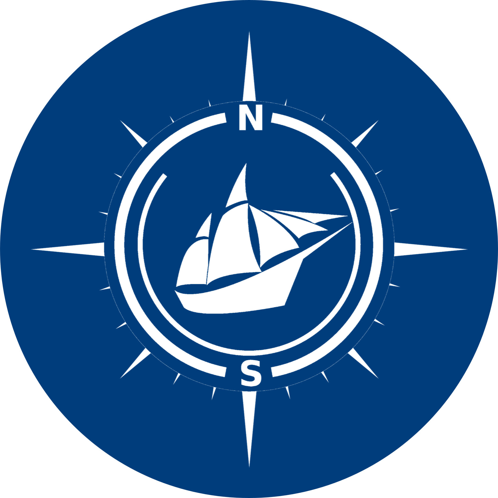

# NUS Seafarers' Website


<figure style="text-align:center;">
  
</figure>

This is the website documenting the voyages of NUS Seafarers, in which we showcase our best stories, photos, videos, and explore interesting topics like celestial navigation, SEA culture and sailing.

## Contribution

We welcome contributions and suggestions from all voyagers. Whether you are a programmer or not, you can always write your blog post, report bugs, or make suggestions under the [Issues](https://github.com/NUSSeafarers/NUSSeafarers.github.io/issues) page of this repository.

If you want to add blog posts by yourself, please [contact our team](mailto:guzh@comp.nus.edu.sg) or ask in the telegram group, so that we can add you into the [NUS Seafarers](https://github.com/NUSSeafarers) organization on GitHub.

Please avoid posting personal information and other sensitive stuff on the website.

### General

- Currently, our website is using [Bulma clean theme](https://github.com/chrisrhymes/bulma-clean-theme), a simple web theme supporting blogs, galleries and youtube videos. You may refer to [this website](https://www.csrhymes.com/bulma-clean-theme/docs/) for detailed documentation on how to create pages, add photos and videos, and many other functionalities.
- Before you commit your contributions, you may build the website locally using jekyll. See [this documentation](https://jekyllrb.com/docs/) for details.


### Adding blog posts

Creating blog posts is very simple and can be done on the GitHub website directly.

- **Step 1**: Create a markdown file under the [`/_posts`](https://github.com/NUSSeafarers/NUSSeafarers.github.io/tree/main/_posts) directory, with the file name in the syntax of `YYYY-MM-DD-title-author.markdown`.
- **Step 2**: At the beginning of the markdown file, add the configurations as the following:

  ```
  ---
  layout: post
  title:  "Voyage across the Equator"
  subtitle: 2017 Across the Equator
  author: "NUS News"
  date:   2017-01-29
  hero_height: small
  hero_image: '/images/hero_images/moonrock_lagoon.jpg'
  source_link: 'https://news.nus.edu.sg/voyage-across-the-equator/'
  image: '/images/voyages/2017-across-the-equator/kayaks-nus-news.png'
  published: true
  ---
  ```

  We summarize the common parameters as follows:

  - `layout`: should be set to `post` for all blog posts.
  - `title`: title of the blog post.
  - `subtitle` (optional): subtitle of the blog post.
  - `author`: author (or source) of the blog post.
  - `date`: date when the blog post was published in `YYYY-MM-DD` format.
  - `hero_height`(optional): height of the [bulma hero](https://www.csrhymes.com/bulma-clean-theme/docs/pages/hero/). Recommended to set to `small` if `hero_image` is not set.
  - `hero_image` (optional): image to be put on the top of the page as the background of the title. Can be dimmed by adding another line `hero_darken: true`.
  - `source_link` (optional): link to the related websites.
  - `image` (optional): image that is shown on the [`blogs`](https://nusseafarers.github.io/blog/) webpage.
  - `published`: should be set to `true` to be visible on the website.
  

  Please refer to [this documentation](https://www.csrhymes.com/bulma-clean-theme/docs/posts/creating-a-post/) for more options.

- **Step 3**: Write your blog post below the configuration. See [this post](./_posts/2017-01-29-voyage-across-the-equator-nus-news.markdown) for an example.

- **Step 4**: Commit your blog post to the `main` branch and the website should update in a few minutes.

### FAQ

1. **Q**: How can we add our own images?
   
   **A**: please add all images under the [`/images/`](./images/) directory. For images of individual voyages, put them under separate subdirectories under `/images/voyages`.

   To import an image in a page, you may copy the following code.

   ```html
   <figure style="max-width: 800px; margin-left: auto; margin-right: auto;">
   
   <figcaption>The week-long 400-kilometre voyage started off from Batam, with stops on the islands of Benan, Sebangka, Lingga, Gojong, before anchoring at Pulau Telang on their return.</figcaption>
   </figure>
   ```

   where the link to the image (online or local) should be put after `img src=`, the caption (optional) should be written between `<figcaption>`, and the figure size can be adjusted by modifying the `max-width` parameter.


1. **Q**: How to use custom fonts?
   
   **A**: You may select font families in [Google fonts](https://fonts.google.com/?preview.text=NUS%20Seafarers&preview.text_type=custom) (by clicking the `+` signs on the right of individual styles), then press the `View Selected Families` button on the top right of the webpage. Under the `Use on the web` section, copy the line of code starting with `@import url(...)` into [`/assets/css/app.scss`](./assets/css/app.scss). You may now use the font by adding

   ```css
   font-family: 'Name of the new font';
   ```

   in the CSS style.